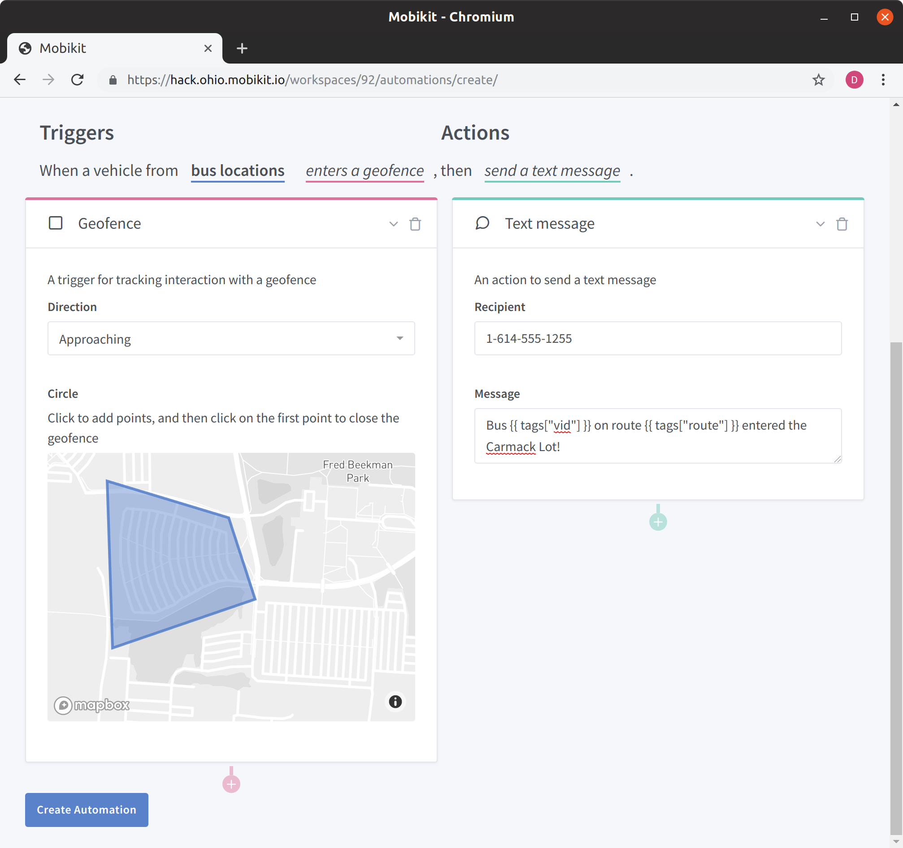
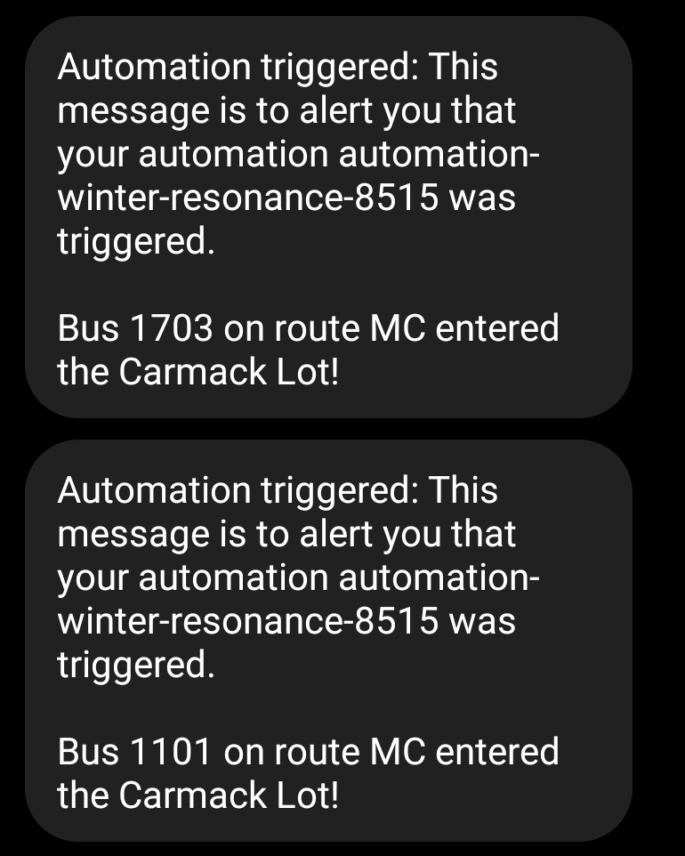

# CABS Bus Alert

This folder contains a Python script ingesting data from an external source in Mobikit via the Mobikit Stream API. The following script is included:

- `stream-cabs-data.py`: script to stream CABS bus data into Mobikit

## Requirements

- Python 3.6+

## Ingestion Quick Start

Start by cloning this repo and navigating into this example's directory:

```bash
git clone https://github.com/mobikitinc/mobikit-examples.git
cd mobikit-examples/bus-alert
```

Create a Python virtual environment using the Python interpreter you want to
use (i.e. `python3` is Python 3.6 on my machine):

```bash
python3 -m venv my_venv
```

Activate the virtual environment and install required packages:

```bash
source my_venv/bin/activate
pip install -r requirements.txt
```

Set environment variables for the Mobikit Stream API URL and your Mobikit API token. You can get your Mobikit API token by navigating to Mobikit and copying it from your user settings page. Here is an example of how to set environment variables in `bash`:

```bash
export MOBIKIT_STREAM_API_URL='https://stream.ohio.mobikit.io/'
export MOBIKIT_API_TOKEN='FILL_ME_IN'
```

Now you can run the script:

```bash
# Note that `feed-id` should be a Mobikit Realtime Feed ID
./stream-cabs-data.py --feed-id 86
```

The scripts has a `--help` flag that will print out some usage information and describe the flag used above.

## Creating an Automation

Once a data feed has been created and data is being streamed to it you can use Mobikit to build automatons on top of it. An automation consists of one or more triggers and one or more events.

Here we will be building an example automation that sends a text message when a bus enters a parking lot:



And, once a bus enters the lot:


