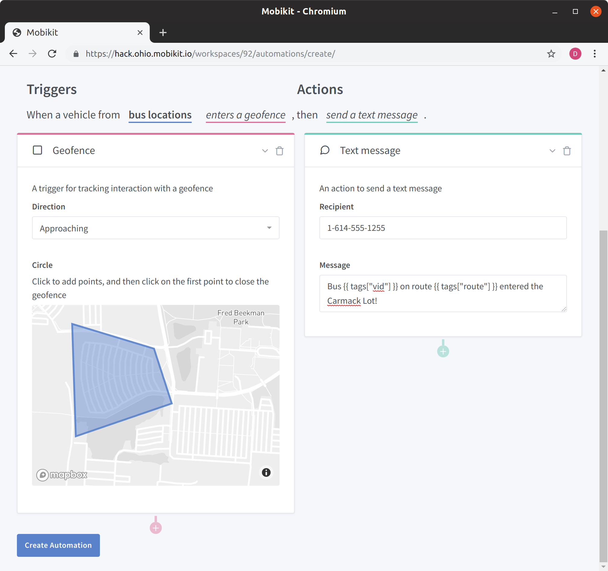
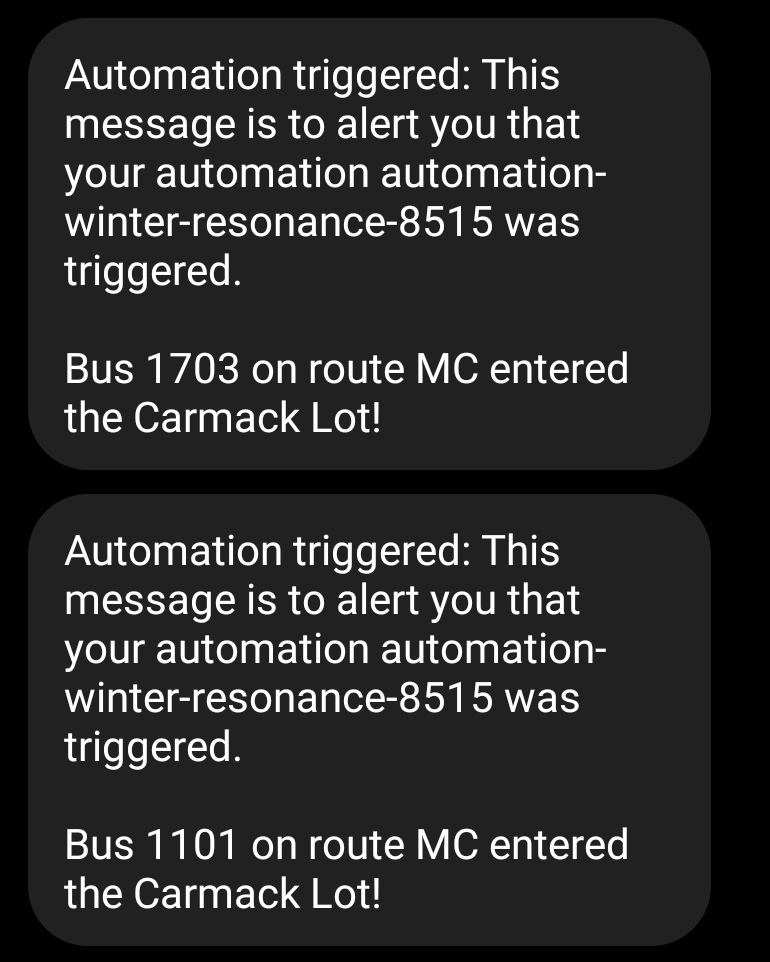

# Bus Location Notifications

This is an example of ingesting data from external sources.
It pulls live bus data from OSU CABS bus routes.

## Streaming Data

### Dependencies

Depends on python3, [mobikit](https://pypi.org/project/mobikit/), [python-socketio](https://pypi.org/project/python-socketio/), and [geojson](https://pypi.org/project/geojson/).

### Environment Variables

Set `MOBIKIT_API_TOKEN` with user auth token.
Set `MOBIKIT_STREAM_API_URL` to target, eg `https://stream.ohio.mobikit.io`.

### Running

Usage `./cabs <FEED ID>`, eg `./cabs 123`.

## Creating Automations

Once a data feed has been created and data is being streamed to it you can use it to build automatons.

For example, the following automation sends a text when a bus enters a parking lot:

And, once a bus enters the lot:

